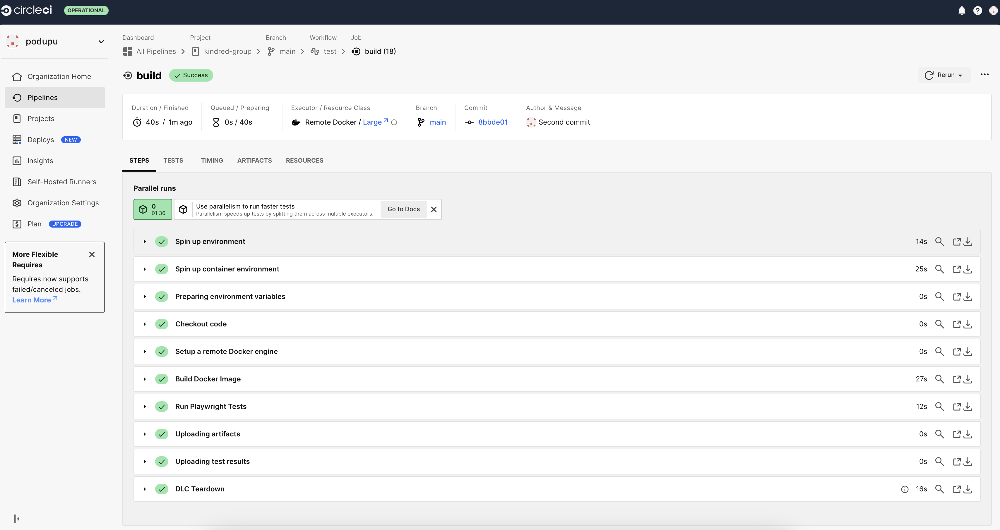
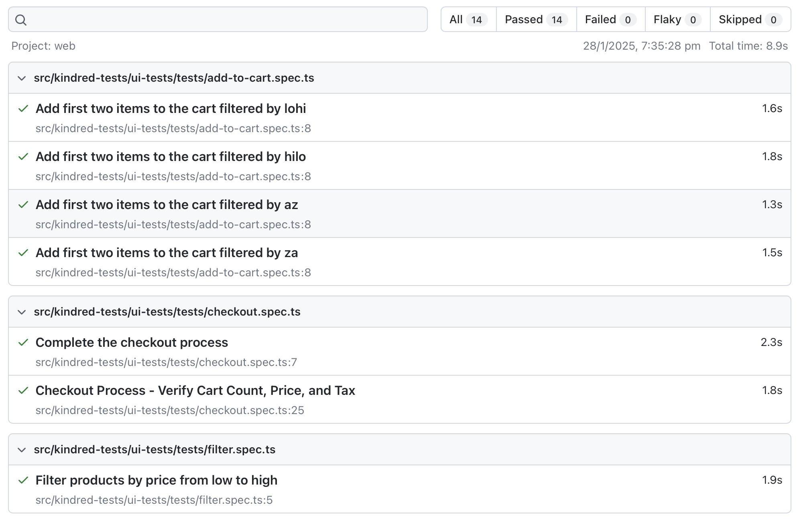
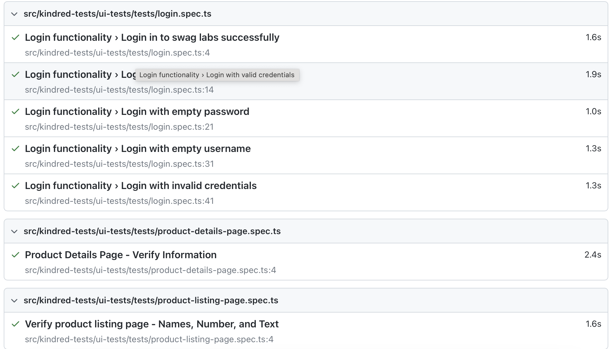

### Kindred group



### Instructions

# Project Name 
    * kindred

## Prerequisites

Before you begin, ensure you have met the following requirements:

- **Git**: Ensure you have Git installed. You can download it from [git-scm.com](https://git-scm.com/).
- **Node.js and yarn**: Make sure you have Node.js and yarn installed. You can download them from [nodejs.org](https://nodejs.org/). Verify the installation by running:
  ```bash
  node -v
  npm -v
  ```


## Installation

To install the project, follow these steps:

1. **Clone the repository**:
   ```bash
   git clone https://github.com/podupu/kindred-group.git
   ```

2. **Navigate to the project directory**:
   ```bash
   cd kindred-group
   ```

3. **Install dependencies**:
   ```bash
   yarn install
   ```

4. **Playwright**: Playwright is a Node.js library to automate Chromium, Firefox, and WebKit with a single API. Install it using yarn:
  ```bash
  yarn add playwright
  ```
## Usage

To run the Playwright tests, use the following command:
```bash
npx playwright test
```

## Project Structure

Here's a brief overview of the project structure:

```
kindred-group/
├── src/
│   ├── ui-tests/
│   │   ├── pages/
│   │   └── test/
│   ├── constants/
│   │   └── selector.ts
│   └── utils/
├── .circleci/
    ├── config.yml
├── package.json
├── tsconfig.json
└── README.md
├── DockerFile
├── playwright.config.ts
└── .gitgnore
```


## Run tests

* Run all tests:
    ```bash
    npx playwright test
    ```
* Run web tests:
    ```bash
    yarn run pw:headless:all
    ```

## CI/CD Architecture

Complete end-to-end CI/CD is accomplished using:

* [CircleCI](https://circleci.com/gh/PODHUPU/kindred/tree/master)
* [DockerHub](https://hub.docker.com/)

### Reports

**Web Chrome**

* View the web test report by opening `playwright report` located in the `playwright-report/` folder.
    
    

## Contributing

To contribute to this project, follow these steps:

1. Fork the repository.
2. Create a new branch (`git checkout -b feature-branch`).
3. Make your changes and commit them (`git commit -m 'Add some feature'`).
4. Push to the branch (`git push origin feature-branch`).
5. Create a pull request.

* Node.js and yarn (latest version)
## License

This project is licensed under the MIT License - see the [LICENSE](LICENSE) file for details.